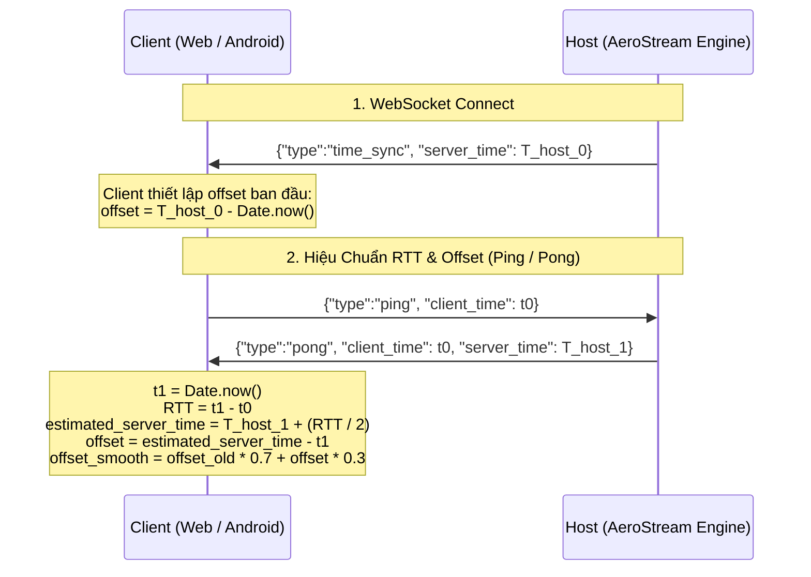

# AeroStream — Kiến Trúc Đồng Bộ Âm Thanh & Hình Ảnh (A/V Synchronization)

> **Tài liệu kỹ thuật Phase 4**  
> **Cập nhật:** 2026-09-16  
> **Mục tiêu:** Thống nhất một gốc đồng hồ monotonic duy nhất trên Host cho cả Video và Audio, đồng bộ hóa giữa Host và Client (Web / Mobile) với độ lệch dưới ±20ms, làm tiền đề trực tiếp cho cơ chế RTCP Sender Report (SR) của WebRTC trong Phase 5.

---

## 1. Vấn Đề Với Đồng Hồ Hệ Thống Cũ (SystemTime Problem)

Trước Phase 4, cả luồng nén Video (`capture.rs`) và luồng thu Audio Loopback (`audio.rs`) đều sử dụng:
```rust
SystemTime::now().duration_since(UNIX_EPOCH).as_millis() as u64
```
Cách tiếp cận này gặp các vấn đề nghiêm trọng trong truyền phát thời gian thực:
1. **Clock Jumps**: `SystemTime` trên Windows là đồng hồ wall-clock. Khi hệ điều hành đồng bộ giờ qua mạng (NTP sync), điều chỉnh múi giờ hoặc người dùng đổi giờ, timestamp có thể nhảy vọt hoặc lùi lại.
2. **Độ phân giải thô (Timer Resolution)**: Trên Windows, `SystemTime` mặc định có độ phân giải thô (~15.6ms), không đủ mịn cho khung hình 60 FPS (16.6ms) hay gói âm thanh 20ms.
3. **Độ lệch lệch múi giữa các luồng (Inter-Thread Drift)**: Luồng GPU capture và luồng WASAPI capture chạy độc lập trên 2 core CPU khác nhau, việc gọi `SystemTime` dẫn đến chênh lệch không thể kiểm soát.
4. **Không tương thích xuyên máy tính**: Client (điện thoại hoặc máy tính khác) có đồng hồ cục bộ lệch với Host hàng giây hoặc hàng phút, khiến công thức đo độ trễ `now - timestamp` hoàn toàn sai lệch.

---

## 2. Giải Pháp: Unified Monotonic Clock Dựa Trên Windows QPC

### 2.1 Cấu Trúc Gốc Đồng Hồ Monotonic (`src/clock.rs`)
AeroStream chuẩn hóa toàn bộ hệ thống trên phần cứng **Windows QueryPerformanceCounter (QPC)**:
- Tần số đếm cứng QPC (`QueryPerformanceFrequency`) trên các CPU hiện đại đạt **10,000,000 Hz** (chu kỳ 100 nano-giây).
- Invariant TSC: Không bị ảnh hưởng bởi thay đổi xung nhịp CPU, không bao giờ chạy lùi, không bị trôi do NTP.
- Cố định một mốc base tại thời điểm Host khởi động (`QPC_BASE_TICKS` và `UNIX_BASE_MS`):
  $$\text{Current Time (ms)} = \text{UNIX\_BASE\_MS} + \frac{(\text{QPC\_Ticks} - \text{QPC\_BASE\_TICKS}) \times 1000}{\text{QPC\_FREQ}}$$

### 2.2 Đặc Tính Đạt Được
- **Độ phân giải siêu cao**: Dưới 1 micro-giây.
- **Tính đơn điệu tuyệt đối (Monotonicity)**: Đảm bảo gói tin sau luôn có timestamp lớn hơn hoặc bằng gói tin trước.
- **Duy nhất cho Video & Audio**: Cả frame H.264 và gói Opus 48kHz đều đọc từ cùng một hàm `crate::clock::qpc_now_ms()`.

---

## 3. Cấu Trúc Packet & Vị Trí Timestamp

```
┌────────────────────────────────────────────────────────────────────────┐
│                        VIDEO FRAME (H.264 / JPEG)                      │
├──────────────────┬──────────────────┬──────────────────┬───────────────┤
│ QPC Timestamp    │ Width            │ Height           │ Bitstream NAL │
│ (8 bytes, u64 BE)│ (2 bytes, u16 BE)│ (2 bytes, u16 BE)│ (Annex-B)     │
│ Bytes 0..8       │ Bytes 8..10      │ Bytes 10..12     │ Bytes 12..N   │
└──────────────────┴──────────────────┴──────────────────┴───────────────┘

┌────────────────────────────────────────────────────────────────────────┐
│                        AUDIO PACKET (Opus 48kHz)                       │
├──────────────────┬──────────────────┬──────────────────────────────────┤
│ Magic Prefix     │ QPC Timestamp    │ Encoded Opus Payload             │
│ [0xFA, 0xFA]     │ (8 bytes, u64 BE)│ (128 kbps, 20ms frame)           │
│ Bytes 0..2       │ Bytes 2..10      │ Bytes 10..N                      │
└──────────────────┴──────────────────┴──────────────────────────────────┘
```

---

## 4. Giao Thức Handshake & Đồng Bộ Host - Client (Clock Offset Calibration)

Để loại bỏ sự chênh lệch giờ giữa Host và Client (Web/Android), hệ thống áp dụng thuật toán hiệu chuẩn offset:



- Nhờ có `serverClockOffset`, Client luôn biết chính xác thời gian hiện tại của Host:
  $$\text{Host Current Time} = \text{Date.now()} + \text{serverClockOffset}$$
- Độ trễ một chiều (One-way Latency) của từng frame được tính chính xác:
  $$\text{Latency} = \text{Host Current Time} - \text{Frame Timestamp}$$

---

## 5. Cơ Chế Điều Phối Đồng Bộ Phát A/V Trên Client (Lip-Sync)

### 5.1 Nguyên Tắc
- **Audio là Master Clock**: Bộ giải mã âm thanh (`AudioContext` trên Web, `AudioTrack` trên Android) chạy ở nhịp cố định 48,000 mẫu/giây với buffer tối thiểu (~25ms).
- **Video bám theo Audio**: Video rendering được điều chỉnh để khớp với mốc thời gian âm thanh đang phát.

### 5.2 Ngưỡng Đồng Bộ (Tolerance Thresholds)
| Độ Lệch ($T_{\text{video}} - T_{\text{audio}}$) | Trạng Thái | Hành Vi Xử Lý |
|---|---|---|
| **$| \Delta | \le 20\text{ ms}$** | **Đồng bộ hoàn hảo** | Render frame ngay lập tức trên màn hình |
| **$\Delta < -40\text{ ms}$** | **Video bị trễ sau Audio** | Tăng tốc độ giải mã, bỏ qua xử lý đồ họa phụ, hiển thị tức thì |
| **$\Delta > +50\text{ ms}$** | **Video chạy nhanh hơn Audio** | Giữ frame nhẹ để Audio đuổi kịp, duy trì độ mượt |

---

## 6. Lộ Trình Chuyển Tiếp Sang Phase 5 (WebRTC RTCP SR)

Kiến trúc QPC thống nhất ở Phase 4 được thiết kế để ánh xạ 1:1 sang WebRTC:
1. **NTP Timestamp trong RTCP Sender Report**:
   - `QPC_BASE_TICKS` và `qpc_now_ms()` sẽ được dùng để tạo trường NTP 64-bit chuẩn trong các gói **RTCP SR**.
2. **RTP Timestamp**:
   - Audio Opus: Tăng 960 tick cho mỗi frame 20ms ở clock 48kHz.
   - Video H.264: Tăng theo clock 90kHz (1500 tick cho mỗi frame 60 FPS).
3. **NetEQ Jitter Buffer**:
   - Client WebRTC sẽ tự động ánh xạ RTP timestamp về mốc QPC tương ứng, đạt độ trễ môi (lip-sync) dưới 15ms mà không cần logic can thiệp thủ công.
